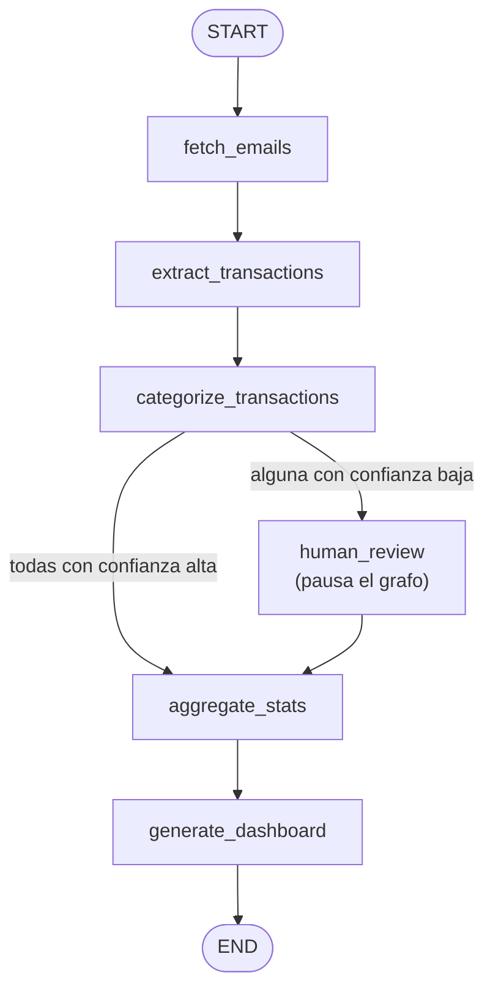

# Expense Insights Agent

Agente en LangGraph que lee tus alertas bancarias en Gmail, extrae y categoriza cada transacción con
Gemini, y te pide confirmación cuando no está seguro de la categoría, antes de generar un dashboard de
gastos.

Proyecto de práctica para el curso [AI Agents in LangGraph](https://www.coursera.org/projects/ai-agents-in-langgraph)
(DeepLearning.AI): en vez de los ejercicios del curso (un agente de búsqueda con Tavily), aplico los
mismos conceptos — componentes de LangGraph, una tool "agentic" propia, persistencia con checkpoints,
streaming y human-in-the-loop — a un problema real: mis propios correos bancarios.

## ¿Qué es?

Un backend en FastAPI que orquesta un grafo de LangGraph: busca en Gmail las notificaciones de tu banco,
le pide a un LLM que extraiga cada transacción (comercio, monto, tipo, tarjeta) y la categorice, y solo
interrumpe el flujo para pedirte confirmación cuando la categoría es ambigua. El resultado es un
dashboard con el total gastado, el desglose por categoría y comercio, y la evolución en el tiempo.

No hay login ni multi-tenant: pensado para correr en tu propia máquina, sobre tu propia cuenta de Gmail.

## Stack técnico

| Capa | Elección | Por qué |
| --- | --- | --- |
| Orquestación del agente | [LangGraph](https://langchain-ai.github.io/langgraph/) (`StateGraph` + `interrupt`/`Command`) | Nodos y edges condicionales modelan el pipeline explícitamente; `interrupt()` da human-in-the-loop sin armar una máquina de estados a mano |
| LLM | Gemini vía `langchain-google-genai` | `with_structured_output` da salida tipada (Pydantic) directo del LLM, sin parsear texto a mano; mismo proveedor que uso en [Research Assistant](https://github.com/JuSebasCel/Research-Assistant) |
| Persistencia | `SqliteSaver` (`langgraph-checkpoint-sqlite`) | Checkpoint por `thread_id`: no reprocesa correos ya vistos entre corridas, y sobrevive un restart del servidor con una revisión humana a medias |
| Fuente de datos | Gmail API, OAuth con scope `gmail.readonly` | Acceso de solo lectura: el agente no puede enviar, borrar ni modificar nada en la cuenta |
| Backend | FastAPI | El progreso del grafo se transmite en vivo por SSE (`GET` + `EventSource`), sin necesitar un frontend con build propio |
| Dashboard | Plotly + Jinja2 | Gráficos interactivos embebidos como HTML plano |

## Estructura del proyecto

```
src/expense_agent/
├── core/           # Settings (pydantic-settings), formato SSE compartido
├── models/         # Transaction, Category, TransactionType (Pydantic); GraphState
├── providers/      # Gmail (OAuth + búsqueda) y el cliente de Gemini
├── graph/          # Los nodos del agente y el ensamblado del StateGraph
├── services/       # Construcción de las figuras Plotly y render del dashboard
├── api/            # Rutas de FastAPI (disparar análisis, resolver revisión, ver dashboard)
└── templates/      # Jinja: formulario inicial y dashboard final

tests/
├── fixtures/       # Correos reales de Bancolombia usados como fixture
├── conftest.py     # Dobles de prueba: Gmail y LLM, sin red ni credenciales
└── test_*.py       # Nodos en aislamiento + grafo completo (incluye el camino de interrupt/resume)
```

## Setup

### 1. Dependencias

```bash
uv sync
```

### 2. Gemini API key

Conseguila gratis en https://aistudio.google.com/apikey y ponela en `.env`:

```bash
cp .env.example .env
# editar .env y pegar GEMINI_API_KEY
```

### 3. Credenciales de Gmail (OAuth)

El agente necesita su propio acceso OAuth de solo lectura a tu Gmail:

1. Creá un proyecto en [Google Cloud Console](https://console.cloud.google.com/).
2. "APIs & Services" → "Library" → habilitá **Gmail API**.
3. "APIs & Services" → "OAuth consent screen": tipo **External**, modo **Testing**, agregate a vos
   mismo como *test user*.
4. "APIs & Services" → "Credentials" → "Create Credentials" → **OAuth client ID** → tipo **Desktop app**.
   Descargá el JSON.
5. Guardalo como `secrets/credentials.json` (esa carpeta está en `.gitignore`, nunca se sube).

La primera corrida abre el navegador para autorizar el acceso; después queda cacheado en
`secrets/token.json`.

## Correr en local

```bash
uv run uvicorn expense_agent.main:app --reload
```

Abrí `http://localhost:8000`, elegí un rango de fechas y dale a "Analizar". Si alguna transacción queda
con categoría ambigua, el grafo se pausa y te pide que la confirmes antes de armar el dashboard final.

### Scripts

| Comando | Qué hace |
| --- | --- |
| `uv run uvicorn expense_agent.main:app --reload` | Servidor de desarrollo |
| `uv run pytest` | Suite de tests — mockea Gmail y el LLM, corre sin credenciales ni red |
| `uv run ruff check .` | Lint |

## Cómo funciona



1. **`fetch_emails`**: busca en Gmail los remitentes bancarios conocidos, filtrando los correos cuyo id
   ya esté en el estado persistido (no reprocesa lo ya visto).
2. **`extract_transactions`**: por cada correo nuevo, el LLM devuelve un `ExtractedTransaction`
   estructurado (comercio, monto, tipo, tarjeta). La fecha final sale del header del correo, no del
   texto — ver [Decisiones técnicas](#decisiones-técnicas).
3. **`categorize_transactions`**: el LLM asigna una categoría + nivel de confianza. Las que ya tenían
   categoría de una corrida anterior se saltan.
4. **Edge condicional**: si alguna transacción quedó con confianza baja, el grafo va a `human_review`;
   si no, directo a `aggregate_stats`.
5. **`human_review`**: usa `interrupt()` para pausar la ejecución y exponer las transacciones ambiguas;
   el front las muestra con un `<select>` por categoría, y al confirmar se reanuda el grafo con
   `Command(resume=...)`.
6. **`aggregate_stats` → `generate_dashboard`**: totales, gasto por categoría/comercio/fecha, y el
   render final con Plotly.

## Features

- Lee alertas bancarias reales de Gmail (hoy Bancolombia; el remitente de otros bancos es
  configurable) y extrae comercio, monto, tipo y tarjeta con salida estructurada del LLM.
- Categoriza cada gasto automáticamente; si la confianza es baja, pausa y pide confirmación humana
  antes de seguir.
- No reprocesa correos ya vistos entre corridas — idempotencia vía checkpoint persistido en SQLite.
- Progreso en vivo por Server-Sent Events mientras corre el análisis.
- Dashboard con total gastado, gasto por categoría, top comercios y evolución por fecha.
- Suite de tests íntegramente mockeada (sin credenciales ni llamadas de red), usando correos reales
  como fixture.

## Decisiones técnicas

**¿Por qué la fecha sale del header del correo y no del texto que extrae el LLM?** El header (RFC 2822)
es una fuente estructurada y confiable; pedirle al LLM que interprete fechas en español desde texto
libre (`"el 08/07/2026 a las 08:23"`) es una fuente de error evitable cuando ya hay un dato confiable
disponible.

**¿Por qué un solo `thread_id` fijo en vez de uno por corrida?** El objetivo es un historial acumulado
de gastos, no análisis aislados: todas las corridas alimentan el mismo estado persistido, y por eso
`fetch_emails` puede excluir lo ya procesado.

**¿Por qué extracción y categorización son dos nodos separados?** Separar "qué transacción es" de "qué
tan segura es la categoría" permite que `categorize_transactions` se salte transacciones ya
categorizadas en corridas posteriores, y que la intervención humana sea puntual (solo la categoría
ambigua), no repetir todo el trabajo de extracción.

**¿Por qué SSE y no WebSockets para el streaming del progreso?** El progreso solo fluye
servidor→cliente y termina solo; SSE es la herramienta más simple que alcanza, sin mantener una
conexión bidireccional abierta.

## Limitaciones conocidas

- `BANK_SENDERS` (en `core/config.py`) solo tiene confirmado el remitente real de Bancolombia; el de
  Nequi es un placeholder sin validar contra un correo real todavía.
- Pensado para una sola persona en su propia máquina: la app web no tiene autenticación propia, y el
  grafo corre sobre un único `thread_id`.

## Licencia

[MIT](LICENSE)
